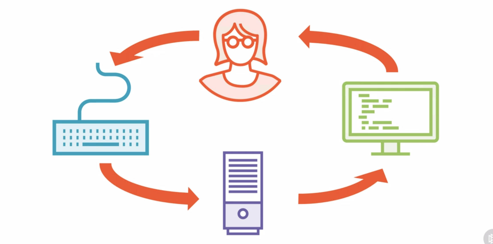

# Command-line Applications 

If we look at things from a very high level, We are going to start by looking at user. Obviously the User in someway interacting with computer, The computer is where the program is going to execute. 

Now a command line interface relies on two more elements.
1. Monitor :- Standard output or the location that we're going to get information from our program.
2. Keyboard :- Primary device that we're going to use to input commands into our CLI application. 

So the way this works is the program, that represented by our computer here, is going to generate some output to the screen (monitor), We are going to interpret that information, and then we're going to make a decision about what a program should do next and enter that decision into the keyboard. The keybooard is going to send it's input back to our program,which is going to calculate what it should do next, generate that result to the screen, We're going to see that, we are going to issue more commands, and so on.

