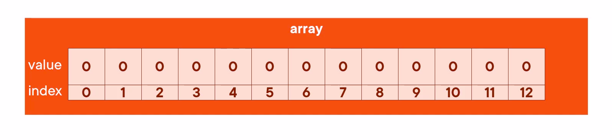

# Array

An Array is a fixed size collection of data elements that all have the same type. 

- Value :- Array has multiple values inside it of same data type
- Index :- The position of value inside a arrry which starts with one and increment by one. 




```go
var arr [3]int // array of 3 ints
fmt.Println(arr) // [0 0 0]
arr = [3]int{1, 2, 3} // array literal

fmt.Println(arr[1]) // 2
arr[1] = 99 // update value
fmt.Println(arr) // [1 99 3]

fmt.Println(len(arr)) // 3


arr := [3]string{"foo", "bar", "baz"}

arr2 := arr
fmt.Println(arr2) // {"foo" "bar" "baz"}

arr[0] = "quux"
fmt.Println(arr) // {"quux" "bar" "baz"}
fmt.Println(arr2) // {"foo" "bar" "baz"}

// It means when we assign array value to array2 it's actually cpoing it values so, if we change the original array the copied array will not change.


arr == arr2 // false, arrays are comparable
```

