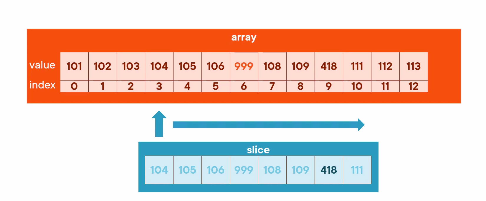

# Slices

The slice datatype is similar to an array, but has a more dynamic nature. It has the ability to grow and shrink over time, which generally makes it more useful in Go programs. 

Slices don't actually hold their own data, A slice always refers to data stored somewhere by some array. 

> The slice is a data structure, just like an array, and it is a collection of a single data type, just as array, but it's not fixed size. 

- A slice in memory is mapped where the first index of the slice is actuallly pointing to a data value in an array somewhere else. We might know what that array is, we might not. We can actually ask Go to manage that array for us, and we'll see that as we get into the demonstrations here in afew minutes. 
- Then a slice, in addition to knowing it's initial position, also knows how many values it's containing. 

- Because the slice doesn't hold it's own data, it's just pointing to data held by array somewhere, if there is change in the underlying array then slice is immdediately going to reflect that change. and it also works other way around. 




```go

var s []int // slices of ints
fmt.Println(s) // [] (nil)
s = []int{1, 2, 3}

fmt.Println(s[1]) // 2
s[1] = 99
fmt.Println(s) // [1 99 3]

s = append(s, 5, 10, 15) // add elements to the slice
fmt.Println(s) // [1 99 3 5 10 15]

s = slices.Delete(s, 1, 3) // remove indices 1, 2  from slice (golang.org/x/exp/slices)  import the slice experement package using 

// go get golang.org/x/exp/slices

fmt.Println(s) // [1 5 10 15]


```