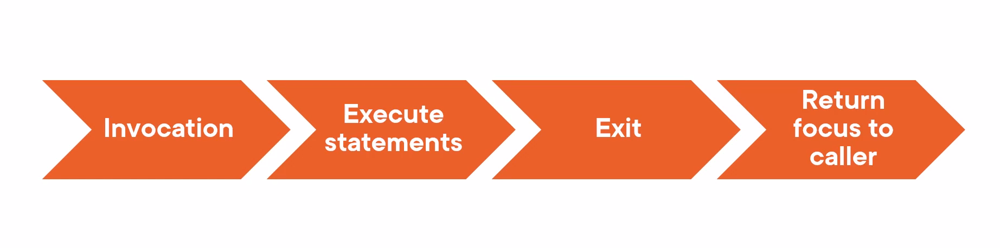
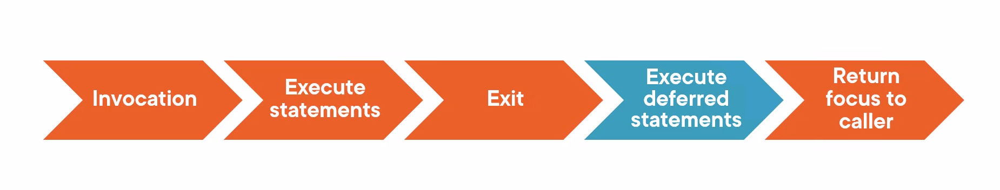

# Deferred Functions

To understand how a deffered function workd in Go, we have to start by talking at a very high level about how a function actually gets invoked.
- So if we think about a function's invocation, we start by invoking the function. Either the Go runtime is going to invoke teh main function, or maybe we call a function thaat we created ourselves. When the function is invoked, then the statements within that function execute. 

- We have seen this so far. We've created thhat main function, and then the go runtime invokes it, and then we started the first statement in the main function and we execute the statements one at a time, At some point, the function runs out of statements to execute, and so it exits, and then it returns focus back to the caller. 



- Main function might run into its last statement, execute that, it says okay, I am don, then it returns focus back to teh Go runtime, And go runtime says oh okk well, the main function is done, it's time to exit the program. 


> Deffered function take advantage of this window between the exiting of the function and returning focus to the caller.




- If  we look at how deffered functions fit in, then fit right here (see the image above) this is where deffered function executes. and this provides really neat capabilities within the Go language. 


## How deferred Function works in go ?

```go
func main() {
    fmt.Println("Main 1")
    defer fmt.Println("defer 1") // making Println function as defer function using defer keyword
    fmt.Println("Main 2")
    defer fmt.Println("defer 2")

}
```

#### How it will execute 

- The min functtion gets invoked by go runtime
- It prints `Main 1` to the screen as it is the first statement of main function 
- Go get's a defer function, Go will not execute it as it need to be execute it to last. So let's assube Go stored it in a internal stack data structure to get it in last
- Then Go print `main 2` to the screen 
- Again it get's a defer function it push it to a internal stack (assumption)
- Now Go finds our that main function has nother to execute now so it will start pulling back the defer function from stack and start ececuting it.

- Stack data structure workd in LIFO concept (Last In First Out) so last `defer 2` will be printed to screen and then `defer 1` will be printed.

> Please keep in mind that go does not really keep defer function in stack data structure, it is just because defer function executed like That we took  assumption that GO push into stack and pull it later.

#### Output of program 

```
Main 1
Main 2
defer 2
defer 1
```

